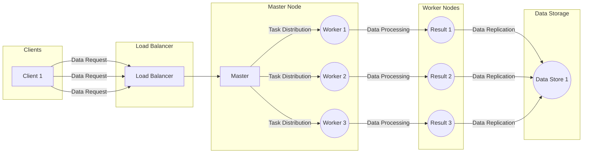

# ElastiCore - Fault-Tolerant Distributed Data Processing System in Go 

## 📜 Introduction

ElastiCore is a robust and scalable fault-tolerant distributed system built in Go, designed to handle massive data processing with efficiency and resilience.

## 🎯 Key Features

- ✅ **Fault Tolerance**: Implements the Raft consensus algorithm for master node replication, ensuring high availability and reliability.
- ✅ **Data Replication**: Includes data replication mechanisms for enhanced data durability in case of node failures.
- ✅ **Load Balancing**: Utilizes a load balancer to evenly distribute incoming requests, optimizing resource utilization.
- ✅ **Scalability**: Easily scales horizontally by adding more worker nodes or master nodes to accommodate growing data processing demands.
- ✅ **Security**: Incorporates authentication and encryption for secure data transmission and access control.

## 🚀 How it Works 

- 💡 The "ElastiCore" system is orchestrated by the 🧠 "Master" node, which intelligently distributes tasks to 🛠️ "Worker" nodes.

- 💪 Each "Worker" node processes the assigned tasks with determination and produces valuable "Results." 🛠️

- ⚖️ The "Load Balancer" efficiently distributes incoming client requests across multiple "Master" nodes, ensuring fairness and resource optimization. ⚙️

- 📁 Data Replication: The processed 📊Results are replicated and stored in a 🗄️Data Store to ensure data durability and resilience in the face of potential failures.

- 💻 Client Interaction: 🧑‍💻Clients interact with the system by sending data processing requests to the 🚦Load Balancer, initiating the data processing workflow.
  
## 🔧 Installation and Usage

Refer to the [documentation](docs/deployment.md) for installation instructions and detailed usage guidelines.

## 🧪 Testing

Run unit and integration tests using `go test` in the root directory.

## 📚 Documentation

For a high-level overview of the system architecture, API reference, and troubleshooting guide, check out our [documentation](docs).

## 📝 Contributing

Contributions are welcome! Please read our [contribution guidelines](CONTRIBUTING.md) before submitting a pull request.

## 📃 License

This project is licensed under the [MIT License](LICENSE).

## 📞 Contact

> Have questions or suggestions? Feel free to reach out to us at contact@elasticore.io.(In Review)

Let's build the future of data processing together! 🌟

